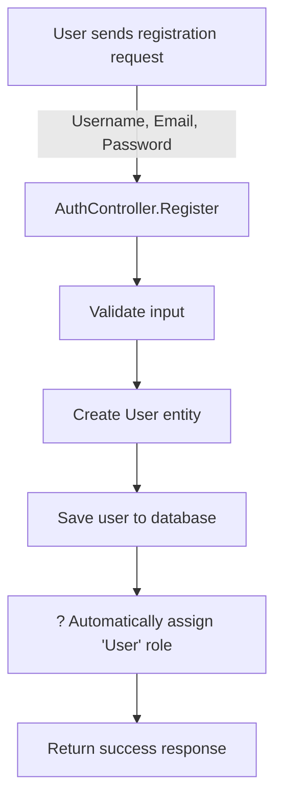

# ? Final Authentication Microservice Configuration

## Summary of Current State

### ? **Role Assignment - Correctly Implemented**

The default "User" role is assigned in the **AuthController** during registration, not taken from user input.

---

## ?? Current Implementation

### 1. **User Entity (Model)** - ? No Role Property
```csharp
// UserMicroservices/Data/Model/Entity/User.cs
public class User : IdentityUser
{
    public string Status { get; set; } = "Unlock";
    public DateTime CreatedAt { get; set; } = DateTime.Now;
    public DateTime? UpdatedAt { get; set; }
}
```

**? Correct:** 
- No `Role` property in User entity
- Uses ASP.NET Core Identity's built-in role system
- Roles are managed in separate AspNetUserRoles table

---

### 2. **RegisterVM (Input Model)** - ? No Role Field
```csharp
// UserMicroservices/Data/ViewModel/Authentication/RegisterVM.cs
public class RegisterVM
{
    [Required(ErrorMessage = "Username is required")]
    [StringLength(20, MinimumLength = 3)]
    public string Username { get; set; }

    [Required(ErrorMessage = "Email is required")]
    [EmailAddress(ErrorMessage = "Invalid email address")]
    public string Email { get; set; }

    [Required(ErrorMessage = "Password is required")]
    [StringLength(25, MinimumLength = 8)]
    public string Password { get; set; }
}
```

**? Correct:**
- No `Role` property
- Users cannot specify their role during registration
- Only Username, Email, and Password are accepted

---

### 3. **AuthController** - ? Default Role Assignment in Controller
```csharp
// UserMicroservices/Controllers/AuthController.cs
[HttpPost("register")]
public async Task<IActionResult> Register([FromBody] RegisterVM payload)
{
    // ... validation code ...
    
    User user = new User()
    {
        Email = payload.Email,
        SecurityStamp = Guid.NewGuid().ToString(),
        UserName = payload.Username,
    };
    
    var result = await _userManager.CreateAsync(user, payload.Password);
    if (!result.Succeeded)
        return StatusCode(500, new { Status = "Error", Message = "User creation failed!" });

    // ? DEFAULT ROLE ASSIGNMENT IN CONTROLLER
    await _userManager.AddToRoleAsync(user, UserRoles.User);

    return Ok(new { Status = "Success", Message = "User registered successfully!" });
}
```

**? Correct:**
- Default "User" role is assigned **automatically** in the controller
- Role assignment happens **after** user creation
- Uses `UserRoles.User` constant for consistency

---

## ?? How It Works

### Registration Flow



1. **User Input:** Only Username, Email, Password
2. **Controller Logic:** Creates user account
3. **Automatic Role:** Assigns "User" role by default
4. **Result:** User registered with "User" role (no user input)

---

## ?? Security Benefits

### ? What Users **CANNOT** Do:
- ? Choose their own role during registration
- ? Assign themselves "Admin" role
- ? Bypass role restrictions
- ? Register without a role (always gets "User")

### ? What the System **DOES**:
- ? Automatically assigns "User" role
- ? Validates all input
- ? Uses Identity framework for role management
- ? Stores roles in separate database table (AspNetUserRoles)

---

## ?? Database Structure

### Tables Involved

1. **AspNetUsers** - User accounts
   ```
   Id, UserName, Email, PasswordHash, Status, CreatedAt, UpdatedAt
   ```

2. **AspNetRoles** - Available roles
   ```
   Id, Name, NormalizedName
   - Admin
   - User
   ```

3. **AspNetUserRoles** - User-Role relationships
   ```
   UserId, RoleId
   (Links users to their roles)
   ```

---

## ?? Available Roles

### Seeded Roles (from AppDbInitializer.cs)

1. **User** (Default)
   - Assigned to all new registrations
   - Standard user permissions

2. **Admin**
   - Created via database seeding
   - Default credentials:
     - Email: `admin@system.com`
     - Password: `Admin@123`

---

## ?? Registration Examples

### ? Valid Registration Request
```http
POST /api/auth/register
Content-Type: application/json

{
  "username": "johndoe",
  "email": "john@example.com",
  "password": "SecurePass123"
}
```

**What Happens:**
1. User account created
2. **Automatically** assigned "User" role
3. Success response returned

**Result in Database:**
```sql
-- AspNetUsers table
Id: "guid-here"
UserName: "johndoe"
Email: "john@example.com"
Status: "Unlock"

-- AspNetUserRoles table (automatic)
UserId: "guid-here"
RoleId: "user-role-guid"
```

---

### ? Invalid Registration Attempts

**Attempt 1: Trying to specify role (will be ignored)**
```http
POST /api/auth/register
Content-Type: application/json

{
  "username": "hacker",
  "email": "hacker@example.com",
  "password": "HackPass123",
  "role": "Admin"  ? This field doesn't exist in RegisterVM
}
```

**Result:** 
- Request will fail with validation error
- Role field is not accepted

---

## ?? Testing

### Test 1: Register New User
```bash
curl -X POST https://localhost:7001/api/auth/register \
  -H "Content-Type: application/json" \
  -d '{
    "username": "testuser",
    "email": "test@test.com",
    "password": "Test1234"
  }'
```

**Expected Result:**
```json
{
  "status": "Success",
  "message": "User registered successfully!"
}
```

### Test 2: Login and Check Role
```bash
# Login
curl -X POST https://localhost:7001/api/auth/login \
  -H "Content-Type: application/json" \
  -d '{
    "email": "test@test.com",
    "password": "Test1234"
  }'
```

**Expected JWT Claims:**
```json
{
  "nameid": "user-guid",
  "unique_name": "testuser",
  "email": "test@test.com",
  "role": ["User"],  // ? Automatically assigned
  ...
}
```

---

## ??? Files Removed (Cleanup Completed)

### ? Removed Files:
1. ? `UserController.cs` - User CRUD operations
2. ? `UserService.cs` - User management service
3. ? `UserUpdateVM.cs` - **Just removed**
4. ? `CreateUserVM.cs` - User creation model
5. ? `AssignRoleVM.cs` - Role assignment model
6. ? `ChangePasswordVM.cs` - Password change model
7. ? `ResetPasswordVM.cs` - Password reset model
8. ? `UpdateUserVM.cs` - User update model
9. ? `UserDto.cs` - User data transfer object
10. ? `UserDTO.cs` - Basic user DTO

### ? What Remains:
- `AuthController.cs` - Authentication only
- `RegisterVM.cs` - Registration input (no role field)
- `LoginVM.cs` - Login input
- `User.cs` - User entity (no role property)
- `UserRoles.cs` - Role constants

---

## ? Final Configuration Summary

| Aspect | Implementation | Status |
|--------|---------------|--------|
| **Role in User Entity** | ? Not included (uses Identity framework) | ? Correct |
| **Role in RegisterVM** | ? Not included | ? Correct |
| **Role in Controller** | ? Automatically assigned "User" | ? Correct |
| **User Input** | Username, Email, Password only | ? Correct |
| **Security** | Role cannot be manipulated by user | ? Correct |
| **Default Role** | "User" assigned automatically | ? Correct |

---

## ?? Conclusion

? **Everything is correctly configured!**

- **No role property in User entity** (uses Identity framework)
- **No role field in RegisterVM** (users cannot specify role)
- **Default "User" role assigned in controller** (automatic)
- **Secure by design** (no user manipulation possible)

The implementation follows best practices for authentication microservices with role-based access control.

---

**Last Updated:** 2024-12-03
**Status:** ? Complete and Verified
**Build Status:** ? Successful
**Microservice:** Authentication Only (No User Management)
